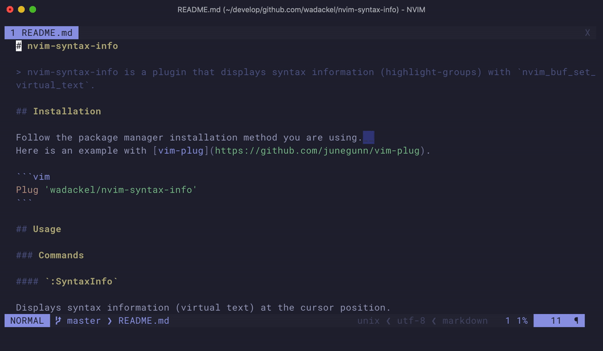

# nvim-syntax-info



**nvim-syntax-info** is a plugin that displays syntax information (highlight-groups) with `nvim_buf_set_virtual_text`.

Displays the highlight group at the cursor position as shown below.

```
  return synIDattr(a:synid, 'name') base=vimNotFunc, linked=Statement
     |__ cursor here.               |_______________________________|
                                               virtual text
```

It will help you customize your colorscheme and make your own colorscheme!

## Installation

Follow the package manager installation method you are using.  
Here is an example with [vim-plug](https://github.com/junegunn/vim-plug).

```vim
Plug 'wadackel/nvim-syntax-info'
```

## Usage

See also [:h nvim-syntax-info](./doc/syntaxinfo.txt).

### Commands

#### `:SyntaxInfo`

Displays syntax information (virtual text) at the cursor position.

#### `:SyntaxInfoClear`

Clear syntax information (virtual text) at the cursor position.

#### `:SyntaxInfoEnable`

Syntax information is displayed automatically when the cursor is moved.

#### `:SyntaxInfoDisable`

Disables display with cursor movement.

#### `:SyntaxInfoToggle`

Switch whether to display syntax information by moving the cursor.

### Mappings

It does not provide a default mapping.
Let's set your mapping using the following keys.

- `<Plug>(syntax-info)`
- `<Plug>(syntax-info-clear)`
- `<Plug>(syntax-info-enable)`
- `<Plug>(syntax-info-disable)`
- `<Plug>(syntax-info-toggle)`

**For example:**

```vim
nmap <silent> <Space>si <Plug>(syntax-info-toggle)
```

### Variables

#### `g:syntaxinfo_format` (Default: `"base=%base%, linked=%linked%"`)

You can specify the content to be displayed in virtual text in the format of `%KEY_NAME%`.

| Key    | Description                            |
| :----- | :------------------------------------- |
| base   | Directly applied highlight group name. |
| linked | Linked highlight group name.           |

#### `g:syntaxinfo_delay` (Default: 250)

Specify the delay millisecond when displaying by moving the cursor.

### Highlights

#### `SyntaxInfo`

The highlight for syntax infomation in virtual text.

**Default:**

```vim
highlight link SyntaxInfo Comment
```

## License

[MIT License © wadackel](./LICENSE)
